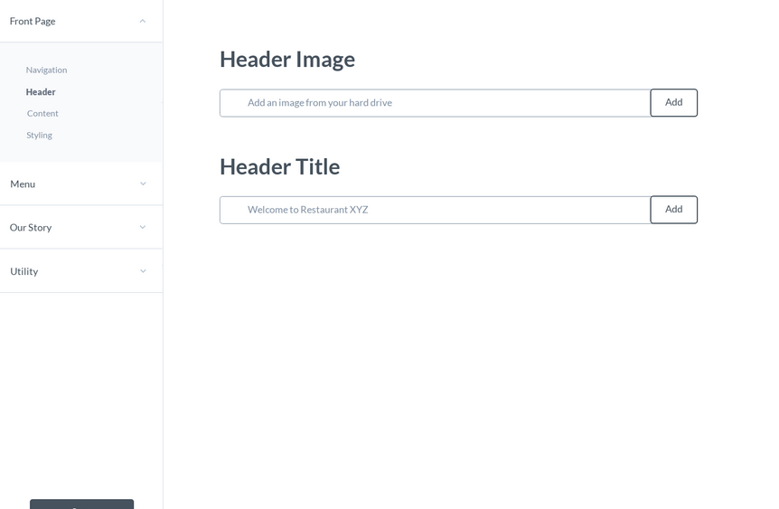
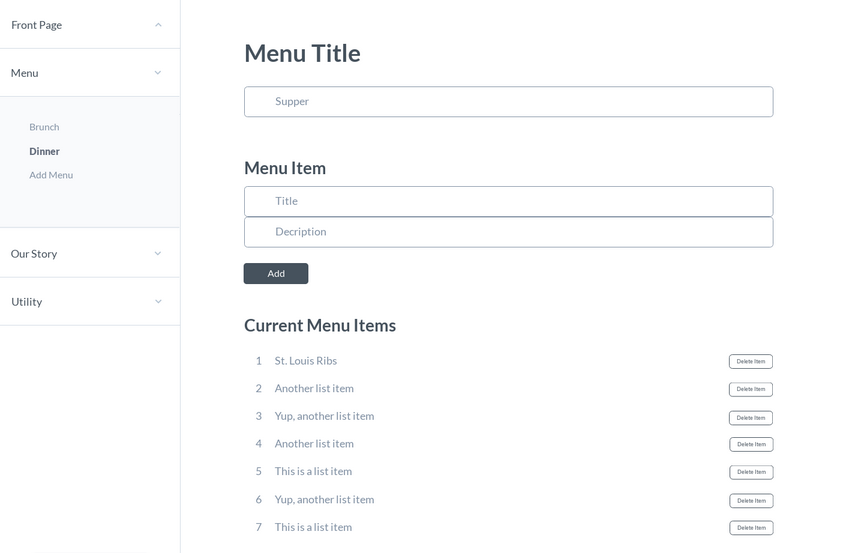
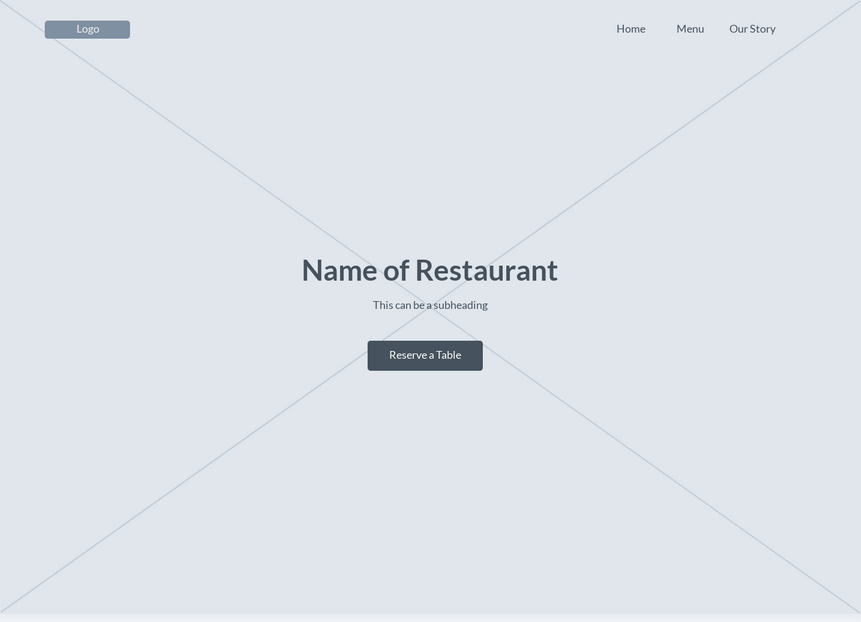

# WEB CHEF
 A *CMS* that enables restaurant owners to create beautiful, intuitive websites with ease, employing a variety of templates, customer interaction handlers, and personalized content.

## Why Create This?
We believe that CMS are a powerful tool, not only for their usefulness in easy website management, but also for the lessons we as developers can learn from creating them. We have chosen to cater to the restaurant owner, because we see CMS technology having an emphasized value to the restaurant business model. Our conclusion here is drawn from two main assessments:
1) That a restaurant's budget typically does no allocate for big web-spending.
2) Because restaurants share a singular purpose , we believe that by narrowing in on our templates' functional requirements, we can expand on their UX options.

## Developers:
1) Spencer Colaco
2) Vaibhav Patel
3) Thomas Arbuthnot

## Technology Stack:
1) **Python, Django**: Back-End/Server-side.
2) **Postgres**: Database Management.
3) **HTML/CSS, Javascript**: Front-end functionality and design.

## Installation:
Inside your chosen directory, clone our repo:
```
git clone https://github.com/vpdacoder/CMS
```
After cloning, you will need to create your database and make the required migrations:
```
createdb cms

python3 manage.py migrate
```
Setup an admin super-user, and run your server:
```
python3 manage.py createsuperuser
python3 manage.py runserver
open your browser to localhost:8000
```


## User Stories:
1) **Young Jewish**, is a Jewish/American rapper who has recently dropped out of relevancy within the rap game. He spent most of his scratch on jewelry, strippers, and substance. Poor guy didn't think to invest, and now his family is disappointed in his poor money management. His grandmother is the only one to offer help. She's a mean cook, and knows a guy who will buy her grandson's cuban links. They gather the money to start up a small restaurant in downtown Memphis, and all their friends frequent the location. Soon they realize that they need to expand their market, and advertise to the local populace. Young Jewish, or Asher as his birth-name goes, remembers how his PR agent had emphasized internet presence and the importance of creating a brand. He discovers Web Chef, and instantly digs their style. He chooses them because of their fresh templates, and the ease of customization achieved through their administrator panel. He is also psyched to use the customer interaction interface to connect with his fans *ahem*, customers.

2) **Samantha**, has a bakery. She's locally famous for being super creative with her creations, and the events that she hosts. A friend suggested that she promote herself online, showing her how easy it was with Web Chef. After checking it out, Sam fell in love with the design templates that Web Chef offered. She especially adored their interface for blogging her event and community updates.


## Core Goals:
1) Develop an Admin interface within which a user can add to, and manipulate the content on their website.
2) Design responsive and appealing templates that enable the user to add creative fair to their pages.
3) Build an admin input that allows the site owner to host a blog on their site.
4) Construct an effective, interpersonal customer interaction interface using Yelp API that integrates smoothly into a customer's website.

## Stretch Goals:
1) An abundance of templates to give users more creative options.
2) Font stylings and more media embedding capabilities for blog portion.
3) An email newsletter feature
4) Site analytics
5) Inter-site linking capabilities paired with google api to show locations.
6) Online store options to sell merch and ingredients.


## Wireframes:
**Header Form:**



**Menu Form:**



**Homepage:**




**TRELLO:** <https://trello.com/b/nVvnsX3z/unit-4-project>
